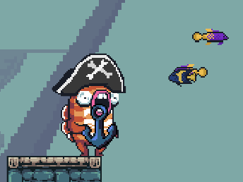

Modding has been a big priority for us with [Jumpy], and today we hit a big milestone:
we successfully implemented an in-game item with the Lua scripting language! After tons
of preparation and a migration to our new [Bones] framework, we were finally able to prove
out the scriptability of our custom Entity Component System ( ECS ), and the functionality
of the new [Piccolo] Lua VM.

[Piccolo] is a Lua VM written Rust by [@kyren]. Deveopment on it was recently picked back
up and Jumpy is one of it's first new users. Since it's written in Rust, Piccolo makes it
possible for us to embed Lua scripting even in the web builds of our game. Being that lua is
simple and already a popular language for game modding, it works great to have a pure Rust
implementation for Jumpy!

The Bones Framework scripting system gives Lua code the ability to access the assets, resources,
entities, and components in the ECS in a way that is reminiscent of the Rust API. Our new runtime
reflection system, [`bones_schema`], allows both Lua and Rust code to access any `#[repr(C)]` data
types directly, giving great power Lua scripts, without a lot of manual effort writing bindings.
This should really expand on the ability of Jumpy mods to do things that we haven't even thought
about yet, because it's got almost as much access to the world as Rust does.

As a proof-of-concept, we used this new power to create an anchor item for Jumpy. All of the
item-specific code is implemented in Lua and YAML files which can be hot-reloaded while the game
is running! You can see all the new anchor assets [here][anchor_assets], and for the curious, below
you will find the full lua code for the anchor item, with extra comments explaining different pieces.

We literally _just_ got this working, so there are limitations here and there that still need
fixing, but the major challenges appear to have been overcome, and we're not goint to stop
there! We've established the foundation for proper asset packs, and soon we hope to have a way
to easily install user mods into the game.

Scripted items are big accomplishment, but we've still got way further to go. I'm excited to continue
the journey! 🚀

<br />



[anchor_assets]: https://github.com/fishfolk/jumpy/tree/a13bd1e83fff2b78a597311f008e67922993e2f8/assets/plugins/anchor
[@kyren]: https://github.com/kyren
[Piccolo]: https://github.com/kyren/piccolo/
[bones]: @/development/bones/introduction.md
[Jumpy]: @/games/jumpy.md
[`bones_schema`]: https://fishfolk.github.io/bones/rustdoc/bones_schema/index.html

---


**`plugin.lua`:**

```lua
-- Import the schemas for types that we will use in the script.
-- "s" is short for schema and is a function that will search the schema registry for
-- a type with a matching name.
local Entities = s"Entities"
local MapElementHydrated = s"MapElementHydrated"
local ElementHandle = s"ElementHandle"
local AnchorMeta = s"AnchorMeta"
local AtlasSprite = s"AtlasSprite"
local Item = s"Item"
local ItemThrow = s"ItemThrow"
local ItemGrab = s"ItemGrab"
local DehydrateOutOfBounds = s"DehydrateOutOfBounds"
local KinematicBody = s"KinematicBody"
local Transform = s"Transform"
local DropItem = s"DropItem"
local ItemUsed = s"ItemUsed"
local IdleAnchor = s"IdleAnchor"
local FallingAnchor = s"FallingAnchor"
local DamageRegion = s"DamageRegion"
local DamageRegionOwner = s"DamageRegionOwner"

-- Define our hydration system, that takes map element spawners that have not be hydrated
-- and spawns anchors where the spawners are.
local function hydrate()
  -- Get the entities resource from the ECS world
  local entities = resources:get(Entities)
  
  -- Iterate over all entities that have an ElementHandle component and that don't have a
  -- MapElementHydrated component.
  for spawner_ent, element_handle in entities:iter_with(ElementHandle, MapElementHydrated:without()) do
    -- The element handle is defined as `ElementHandle(Handle<ElementMeta>)` in Rust, so we can use
    -- the array index syntax to access the inner item.
    --
    -- Here we use `assets` to get the asset data associated with the element handle.
    local element = assets:get(element_handle[0])

    -- Since `element.data` is a `Handle<SchemaBox>` we use assets:get() again, to get the data
    -- pointed to by the handle.
    local anchor_meta = assets:get(element.data)

    -- Since anchor_meta is a SchemaBox, we don't know what it's inner type is, so we check
    -- to see if it's schema matches the AnchorMeta schema. This tells us that the map element
    -- entity is an anchor element.
    if schema_of(anchor_meta) == AnchorMeta then
      -- Now we spawn an anchor by creating entity and attaching the components we need to it.
      local ent = entities:create()

      -- The schema variables that we imported above can be used to create instances of that type,
      -- using the type's Default implementation.
      --
      -- Here we crete a new AtlasSprite struct.
      local sprite = AtlasSprite:create();
      -- And we set it's atlas to the atlas specified in our anchor metadata.
      sprite.atlas = anchor_meta.atlas

      -- We add some more essential components
      components:insert(ent, element_handle)
      components:insert(ent, MapElementHydrated:create())
      components:insert(ent, IdleAnchor:create())
      components:insert(ent, sprite)
      components:insert(ent, components:get(spawner_ent, Transform))
      components:insert(ent, Item:create())
      local item_grab = ItemGrab:create()
      item_grab.fin_anim = anchor_meta.fin_anim
      item_grab.grab_offset = anchor_meta.grab_offset
      components:insert(ent, item_grab)
      components:insert(ent, ItemThrow:create())
      local dehydrate_out_of_bounds = DehydrateOutOfBounds:create()
      dehydrate_out_of_bounds[0] = spawner_ent
      components:insert(ent, dehydrate_out_of_bounds)
      local body = KinematicBody:create()
      body.gravity = assets.root.core.physics.gravity
      body.has_mass = true
      body.has_friction = true
      body.bounciness = 0
      components:insert(ent, body)

      -- Mark spawner as hydrated so that we don't spawn the item again next frame
      components:insert(spawner_ent, MapElementHydrated:create())
    end
  end
end

--- Here we have our update system, which will add all of the logic for our spawned anchors.
local function update()
  local entities = resources:get(Entities)

  -- Loop over all of our idling anchors
  for ent in entities:iter_with(IdleAnchor) do
    -- We get the anchor metadata from it's ElementHandle component
    local element_handle = components:get(ent, ElementHandle)
    local element = assets:get(element_handle[0])
    local anchor_meta = assets:get(element.data)

    -- We try to get the ItemUsed component on it, which is added when a player
    -- tries to use an item
    local used = components:get(ent, ItemUsed)

    -- If the item is being used
    if used then
      -- Remove the idling component and it's kinematic body
      components:remove(ent, KinematicBody)
      components:remove(ent, IdleAnchor)

      -- Insert the falling component, and the DropItem component, to cause the player
      -- to drop it.
      components:insert(ent, FallingAnchor:create())
      components:insert(ent, DropItem:create())

      -- Attach a damage region to the anchor and an owner so it doesn't kill the player
      -- that dropped it.
      local damage = DamageRegion:create()
      damage.size = anchor_meta.body_size
      components:insert(ent, damage)
      local damageOwner = DamageRegionOwner:create()
      damageOwner[0] = used.owner
      components:insert(ent, damageOwner)
    end
  end

  -- Loop over all of our falling anchors
  for ent in entities:iter_with(FallingAnchor) do
    -- Get the element metadata
    local element_handle = components:get(ent, ElementHandle)
    local element = assets:get(element_handle[0])
    local anchor_meta = assets:get(element.data)

    -- Make the anchor fall down
    local trans = components:get(ent, Transform)
    trans.translation.y = trans.translation.y - anchor_meta.fall_speed
  end
end

-- Finally, we must register the two systems that we created to add them to their
-- appropriate stages.
session:add_system_to_stage(CoreStage.PreUpdate, hydrate)
session:add_system_to_stage(CoreStage.PostUpdate, update)
```


