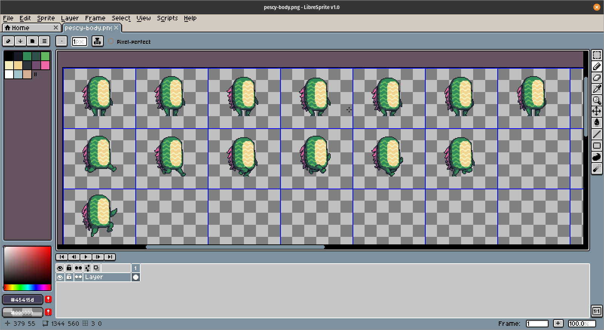

Here we will outline the methods you can use to make new Jumpy character skins with animations. Currently we are keeping character skins within the same basic silhouette as the ones already in the game, so if you are interested in making a new skin, the easiest way is to open an existing Jumpy skin, copy it, and use it as a reference for your new skin.

## Copying a Skin

To open an existing skin, navigate in your file browser to where you have Jumpy saved on your computer. Inside the game folder you will find an `assets` folder that you will want to open. From there open, `player`→`skins`, and you will find the list of skins in the Jumpy game.

For this example, we are going to use Pescy as a reference for your new skin. I suggest using Pescy because some of the other skins have small nuances that make them more complicated. Inside of Pescy's folder you will find three images, `pescy-body`, `pescy-face`, and `pescy-fins`. Along with these images will be four files ending in `.yaml`. Later in this guide we will cover how to edit the `yaml` file to get your skin's animations working, but for now we are going to focus on making the proper images for your animations.

Before you start making your own skin, you will want to create a spot in the Jumpy files to put your new skin. Let's say you are creating a puffer fish skin that we will call Puffy. Inside the jumpy `skins` folder in your file browser, create a new folder and name it `puffy`. Because we want to use Pescy as a reference, go ahead and copy all three images in the `pescy` folder as well as all the `.yaml` files, and put them into your `puffy` folder. Be sure to rename all of the copied files appropriately, for example `puffy-body` and `puffy.player.yaml`, etc.

We are going to be using Libre Sprite to create a new skin in this example, but any other image editor can be used, though some of the steps will vary depending on your chosen tool. If you wish to use Libre Sprite yourself, it can be downloaded for free.

## Editing the Sprites

Now that we have all of the files from `pescy` copied and renamed correctly, go ahead and open `puffy-body`, `puffy-face`, and `puffy-fins` in Libre Sprite. You will be able to see that each image has multiple frames arranged in columns and rows. Each horizontal row has a series of sprites representing the frames necessary for one of the character's animations. In the `pescy-body` image, the first row is all the frames in his idle standing animation. Notice that `puffy-body` is missing both a face and fins because these are each represented in their respective images. These different parts of the character are separated so that they can be animated independent of each other in the game. Despite being separate images though, each row represented in `puffy-body` and `puffy-fins` have a direct relationship to the same associated animation. That simply means that because the first row of frames in `puffy-body` is the standing animation, then the first row of frames in `puffy-fins` is also for the standing animation. This arrangement helps us keep track of what animation each row is used for across different images.

If you view `puffy-faces`, you will notice that it only has one row of frames. The reason for this is that faces are not tied to any particular animation also involving the body and fins. Facial animations can happen during any stage of other animations such as walking and jumping.

### Staying Within the Grid

Every sprite in an image resides in a frame of the same size, but different images have different frame sizes.

- Frame size for`body` 96x80 pixels
- Frame size for`fins` 24x34 pixels
- Frame size for`face` 46x32 pixels

These frame boundaries are not enforced by the editor automatically, so if your not careful you can end up with sprites running from one frame onto the other, which obviously is no good. To avoid this mistake you can use the grid feature.

To do this, use your Menu Bar to select `View`→`Grid`→`Grid Settings`. Set the height and width to the frame size for the image you are editing, for example `puffy-body` would be 96x80. Now a grid will be displayed that allows you to easily see the frame boundaries. Always leave an empty one pixel buffer around your sprites in each frame or that sprite will bleed onto other frames when played in the game.

### Editing on a Layer

So now we can see where each frame is, but our skin is currently a copy of Pescy. To start creating your own skin, the best technique is to create a new layer, by clicking `Layer`→`New Layer` in the Menu Bar. Name the layer that has all of Pescy's sprites `Pescy`, and your new empty layer `Puffy`. Make sure that your `Puffy` layer is above the `Pescy` layer, and now you can start drawing on top of the Pescy sprites in your `Puffy` layer without messing up the `Pescy` layer that you are using as a reference.

When you are finished editing your image, if you try to save it, you will be given a warning saying that a `.png` image doesn't support layers. Instead, in the Menu Bar, click `File`→`Save As` and save your image as an `.ase` file. This will save your layers for future editing. This file can be safely saved in your `puffy` folder with the rest of the images.

When you have finished your new sprites, you can `Save As` and select `png` as the file type. Your final image will always have to be a `.png` to work in the game. You will be given the same error message about layers as before, but you will want to `Save As` anyway. Now it will ask you if you want to overwrite `puffy-body.png` because this image already exists. This is the image we started with, which currently has sprites copied from Pescy on it. We want to replace that image with our new one with Puffy sprites on it, so select `Yes`. One last step is necessary before your image will save properly. Just below the Menu Bar you will see that the file name now displays as a `.png`, but we still have two layers in our image and we know that a `.png` does not support layers. Because we no longer need the `Pescy` layer, delete it and you will be left with the single `Puffy` layer with your new sprites. Save the file again and your sprite will now be safely saved in a proper format.

If you decide that you want to change anything later, you still have your `.ase` file that has the Pescy reference layer in it, and you can make any changes you like to this file. Just remember to save it over the `.png` so that your changes will be applied to the game.

## Updating the YAML Files

Your skin is now complete, but in order to use it in the game, we must configure the `.yaml` files in your `puffy` folder. Because we have used Pescy as a reference for our new skin, the configuration of the `.yaml` files will be simple. Later on we may cover more details on how to control the `.yaml` files, which will allow you to understand how to make more advanced and new animations for your skins. But for now, the process is merely a matter of replacing names. Open each `.yaml` file and find any occurrences of the Pescy and merely rename them Puffy, using the same capitalization used in the original name.

If you have created new sprites for all of the original frames, then congratulations, you should now have a new skin complete with animations!
